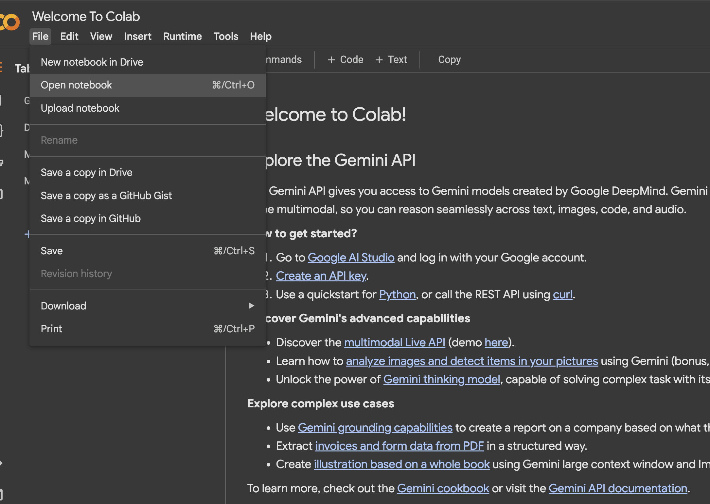
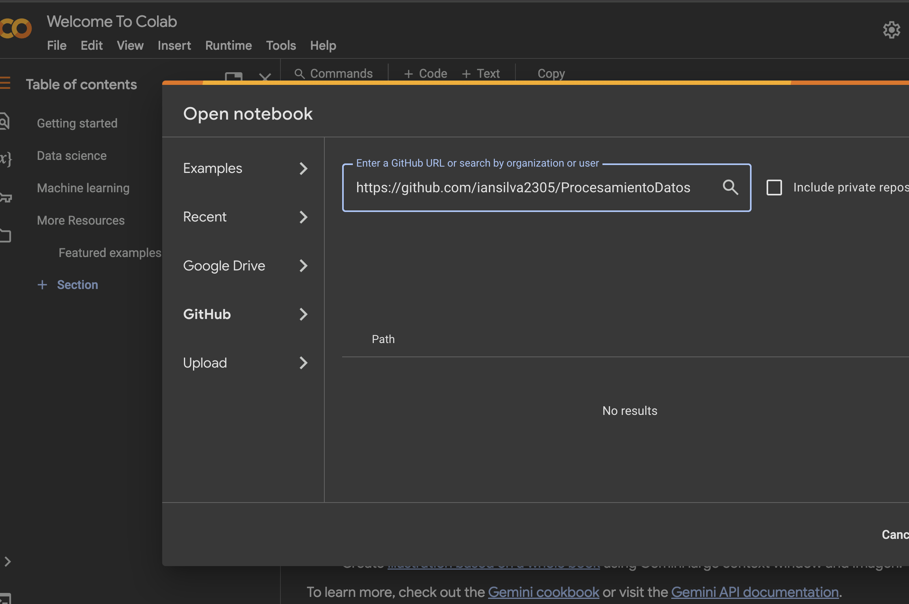
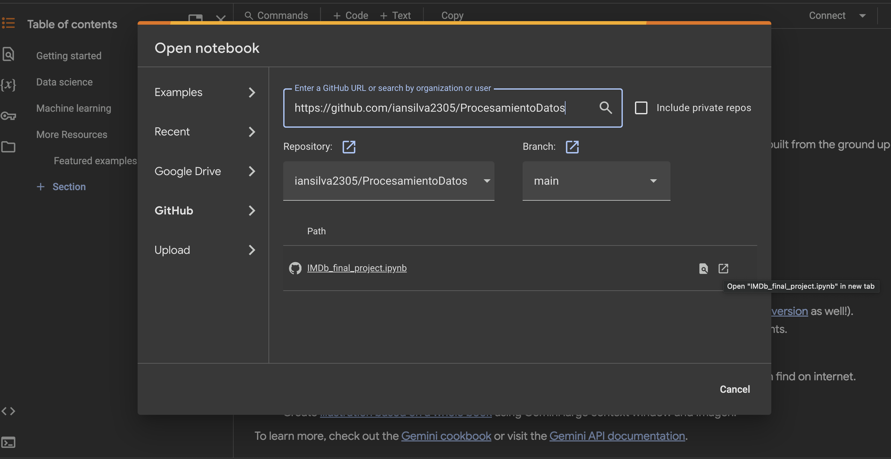
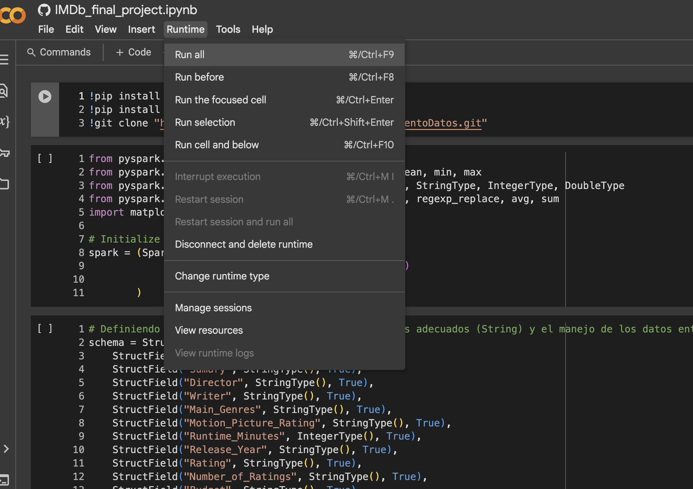

# Instrucciones para abrir el notebook en Google Colab

Abrir notebook en Google Colab (Ir a Archivo y elegir la Opcion Abrir Notebook)

Seleccionar GitHub e ingresar la URL del repositorio (GitHub URL) "<https://github.com/iansilva2305/ProcesamientoDatos>" haciendo clic en la lupa

Luego, seleccionar la opción de Abrir Notebook en una nueva pestaña

Finalmente, seleccionar la opción de Ejecutar todas las celdas

